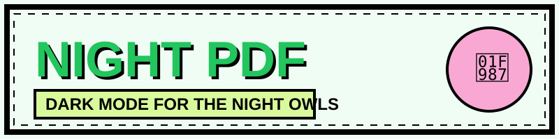

# 🦇 Invert PDF

> **"Because 4 AM study sessions shouldn't burn your retinas."** 🦉🌙

**Invert PDF** is a lighting-fast, 100% private browser-side tool designed for students, researchers, and night owls. Unlike other tools that lazily rasterize pages into flat images, Invert PDF uses transparency blend modes to visually flip colors while keeping the underlying text layer **natively selectable and searchable**.

## 🚀 Key Features

*   🔒 **100% Private:** Magic happens on your device. Files never touch a server.
*   📚 **Batch Mode:** Toss in a whole semester of reading and process them at once.
*   🖱️ **Natively Selectable:** Copy, highlight, and search your PDF just like the original.
*   🎨 **Neo-Brutalist UI:** A quirky, vibey interface that makes studying feel a little less like a chore.
*   📱 **PWA Support:** Install it as a native app on your desktop or mobile.
*   🌙 **Website Dark Mode:** Because the tool itself shouldn't be blinding either.

## 🛠️ How it Works

We use **Transparency Blend Modes** (`Difference` or `Exclusion`).
1.  **Inject Background:** Since many PDFs have transparent backgrounds, we inject a solid white layer first.
2.  **Apply Inversion:** A pure white rectangle is drawn over the entire page using the `Difference` blend mode.
3.  **The Result:** White backgrounds become black, black text becomes white, and **text selection remains 100% functional**.

## 📦 Tech Stack

*   **Pure Vanilla JS/HTML/CSS** (Zero "React shit", zero bloat)
*   **[pdf-lib](https://pdf-lib.js.org/)** (The engine behind the magic)
*   **Tailwind CSS** (via CDN for instant styling)
*   **Vercel** (Zero-cost, lightning-fast hosting)

## 🧙‍♂️ Author

Built with ☕ and slight sleep deprivation by **[@sudoax0n](https://github.com/sudoax0n)**.
Follow me on X: **[@beyondwudan](https://x.com/beyondwudan)**

---
*No innocent PDFs were harmed in the making of this tool. ✌️*
