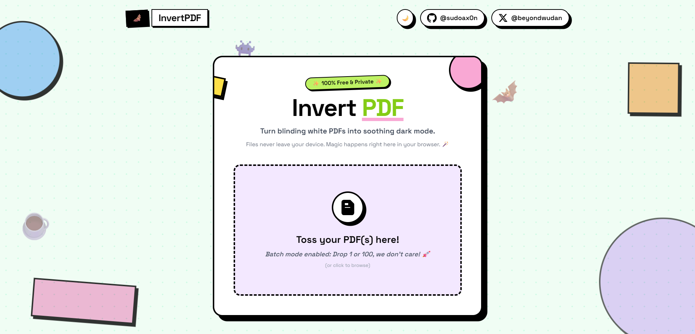

# 🦇 NightPDF

  
   
   <b>"Because your retinas deserve a life too."</b> 

---

## 🛠️ What is this shit?

**NightPDF** is the tool I built because I was tired of blinding myself at 4 AM while studying. Unlike those "lazy" online converters that just turn your pages into low-res images, this thing uses **pure math (blend modes)** to invert colors while keeping the text sharp, selectable, and searchable.

### 🚀 Stupid Fast Features
- 🔒 **100% Private:** No uploads. No tracking. No "cloud" bullshit.
- 📚 **Batch Mode:** Drop a whole textbook or 50 PDFs. We don't care.
- 🖱️ **Selectable Text:** Highlight and copy text like a normal human being.
- 📱 **PWA:** Install it on your phone so you can study in the dark anywhere.
- 🌙 **Website Dark Mode:** Because the tool itself shouldn't be a flashbang.

---

## ☢️ The "Nuked" Button

Yeah, I added a "Download All" button and then **immediately nuked it.** 
Why? Because extracting ZIP files is a chore and I didn't feel like coding the extractor logic. Download your files one by one—it builds character.

---

## 📦 How it works (The nerdy part)
1. **White Layer:** We inject a solid white rectangle behind your content.
2. **Difference Mode:** We draw another white rectangle on top with `BlendMode.Difference`.
3. **Magic:** Colors flip. Black becomes white. White becomes black. Your eyes stop bleeding.

---

## 🧙‍♂️ The Sleep Deprived Dev
Built by **[@sudoax0n](https://github.com/sudoax0n)**.
Check my daily rants on X: **[@beyondwudan](https://x.com/beyondwudan)**

   
  <i>No innocent PDFs were harmed. ✌️</i>

